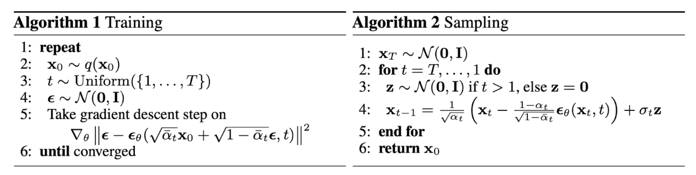

[last updated on 03/09/2023]: Forward, Reverse and Training

- [General Overview of Denoising Diffusion Probabilistic Models (DDPM)](#general-overview-of-denoising-diffusion-probabilistic-models-ddpm)
  - [Forward Diffusion](#forward-diffusion)
  - [Reverse Process](#reverse-process)
  - [Training: ELBO](#training-elbo)
    - [Parameterization on $L\_t$](#parameterization-on-l_t)
    - [$L\_T$ and $L\_0$](#l_t-and-l_0)
  - [Implementation](#implementation)
  - [Reference](#reference)

# General Overview of Denoising Diffusion Probabilistic Models (DDPM)

Some good reviews:
1. [How diffusion models work: the math from scratch](https://theaisummer.com/diffusion-models/?fbclid=IwAR1BIeNHqa3NtC8SL0sKXHATHklJYphNH-8IGNoO3xZhSKM_GYcvrrQgB0o) [1]
2. [What are Diffusion Models?](https://lilianweng.github.io/posts/2021-07-11-diffusion-models/) [2]

## Forward Diffusion
The original data $\x_0\sim q(\x)$ and the Markov chain assumes we add noise to the data $\x_0$ in each time step $t$ and then we get a new conditional distribution
$$q(\x_t\mid \x_{t-1})\sim \N\nbr{\x_t\mid \bm{\mu}_t = \sqrt{1-\beta_t}\x_{t-1}, \bm{\Sigma}_t = \beta_t\bm{I}}$$

A closed form of dependence according to the reparameterization trick:

$$
\begin{align*}
\x_t &= \sqrt{1-\beta_t}\x_{t-1} + \sqrt{\beta_t}\bm{\epsilon}_{t-1} \quad \text{where} \quad \bm{\epsilon}_{t-1}\sim \N\nbr{\bm{0},\bm{I}}\\
&= \sqrt{\alpha_t}\x_{t-1} + \sqrt{1-\alpha_t}\bm{\epsilon}_{t-1} \quad \text{where} \quad \alpha_t = 1-\beta_t
\end{align*}
$$

Furthermore, with the addition of two Gaussian random variable, we can trace back to the data $\x_0$ 

$$
\begin{align}
\x_t &= \sqrt{\alpha_t\alpha_{t-1}}\x_{t-2} + \sqrt{\alpha_t-\alpha_t\alpha_{t-1}}\bm{\epsilon}_{t-2} + \sqrt{1-\alpha_t}\bm{\epsilon}_{t-1} \nonumber\\
    &= \sqrt{\alpha_t\alpha_{t-1}}\x_{t-2} + \sqrt{1-\alpha_{t}\alpha_{t-1}} \bm{\epsilon} \quad \text{where} \quad \bm{\epsilon}\sim \N\nbr{\bm{0},\bm{I}}\nonumber\\
    & \qquad ...\nonumber\\
    &= \sqrt{\bar{\alpha}_t}\x_{0} + \sqrt{1-\bar{\alpha}_{t}} \bm{\epsilon}
\end{align}\\ 
$$

where $\bar{\alpha}_ t = \prod_{i=1}^t \alpha_i $. Usually, $\alpha_i$ will decrease along with the time $t$, and therefore $\bar{\alpha}_t \rightarrow 0$ when $t \rightarrow \infty$. 

## Reverse Process
To generate a new sample, we need to know $q(\x_{t-1} \mid \x_t)$ which is unavailable in practice. **It is also Gaussian if $\beta_t$ is small enough** [3]. A model $p_\theta$ with parameters $\theta$ is involved to approximate $q(\x_{t-1} \mid \x_t)$

$$
p_\theta(\x_{t-1} \mid \x_{t}) = \N\nbr{\x_{t-1}\mid \bm{\mu}_\theta(\x_t, t), \bm{\Sigma}_\theta(\x_t, t)}
$$

$$
p_\theta(\x_{0:T}) = p_\theta(\x_T)\prod_{i=1}^Tp_\theta(\x_{t-1}\mid \x_t)
$$

The reverse process conditioned on $\x_0$ is tractable:

$$
q(\mathbf{x}_{t-1} \vert \mathbf{x}_t, \mathbf{x}_0) = q(\x_t\mid\x_{t-1},\x_0)\frac{q(\x_{t-1}\mid\x_0)}{q(\x_t\mid\x_0)} = \mathcal{N}(\mathbf{x}_{t-1}; \color{blue}{\tilde{\boldsymbol{\mu}}}(\mathbf{x}_t, \mathbf{x}_0), \color{red}{\tilde{\beta}_t} \mathbf{I})
$$ 

The further derivations can be found [here](https://lilianweng.github.io/posts/2021-07-11-diffusion-models/) (complete the square) [1].

$$
\begin{align}
\tilde{\beta}_t 
&= \frac{1 - \bar{\alpha}_{t-1}}{1 - \bar{\alpha}_t} \cdot \beta_t \nonumber\\
\tilde{\boldsymbol{\mu}}_t (\mathbf{x}_t, \mathbf{x}_0)
&= \frac{\sqrt{\alpha_t}(1 - \bar{\alpha}_{t-1})}{1 - \bar{\alpha}_t} \mathbf{x}_t + \frac{\sqrt{\bar{\alpha}_{t-1}}\beta_t}{1 - \bar{\alpha}_t} \mathbf{x}_0 \nonumber\\
&= \frac{1}{\sqrt{\alpha_t}} \Big( \mathbf{x}_t - \frac{1 - \alpha_t}{\sqrt{1 - \bar{\alpha}_t}} \boldsymbol{\epsilon}_t \Big)
= \tilde{\boldsymbol{\mu}}_t
\end{align}
$$
with $\x_0 = \frac{1}{\sqrt{\bar{\alpha}_t}}(\x_t - \sqrt{1 - \bar{\alpha}_t}\bm{\epsilon}_t)$ (derived from Eq. (1))
## Training: ELBO

$$
\begin{align*}
KL\sbr{q(\x_{1:T}\mid\x_0)\mid p_\theta(\x_{1:T}\mid\x_0)} &= \mathbb{E}_{\x_{1:T}\sim q(\x_{1:T}\mid\x_0)}\sbr{\log \frac{q(\x_{1:T}\mid\x_0) p_\theta(\x_0)}{p_\theta(\x_{0:T})}}\\
&= \log p_\theta(\x_0) + \mathbb{E}_{\x_{1:T}\sim q(\x_{1:T}\mid\x_0)}\sbr{\log \frac{q(\x_{1:T}\mid\x_0)}{p_\theta(\x_{0:T})}}\\
\mathbb{E}_{\x_{1:T}\sim q(\x_{1:T}\mid\x_0)}\sbr{\log \frac{q(\x_{1:T}\mid\x_0)}{p_\theta(\x_{0:T})}} &
\geq \mathbb{E}_{\x_{1:T}\sim q(\x_{1:T}\mid\x_0)}\sbr{-\log p_\theta(\x_0)}
\end{align*}
$$

We let 

$$
\begin{align*}
L &= \mathbb{E}_{\x_{1:T}\sim q(\x_{1:T}\mid\x_0)}\sbr{\log \frac{q(\x_{1:T}\mid\x_0)}{p_\theta(\x_{0:T})}}\\
  &= \mathbb{E}_{\x_{1:T}\sim q(\x_{1:T}\mid\x_0)}\sbr{\log \frac{\prod_{t=1}^{T} q(\x_{t}\mid\x_{t-1})}{p_\theta(\x_T)\prod_{t=1}^{T}  p_\theta(\x_{t-1}\mid\x_{t})}}\\
  &= \mathbb{E}_{\x_{1:T}\sim q(\x_{1:T}\mid\x_0)}\sbr{-\log p_\theta(\x_T) + \sum_{t=2}^T\log \frac{q(\x_t\mid\x_{t-1})}{p_\theta(\x_{t-1}\mid\x_t)} + \log\frac{q(\x_1\mid\x_0)}{p_\theta(\x_0\mid\x_1)}}\\
  &= \mathbb{E}_{\x_{1:T}\sim q(\x_{1:T}\mid\x_0)}\sbr{-\log p_\theta(\x_T) + \sum_{t=2}^T\log \nbr{\frac{q(\x_{t-1}\mid\x_{t},\x_0)}{p_\theta(\x_{t-1}\mid\x_t)}\frac{q(\x_t\mid\x_0)}{q(\x_{t-1}\mid\x_0)}} + \log\frac{q(\x_1\mid\x_0)}{p_\theta(\x_0\mid\x_1)}}\\
  &= \mathbb{E}_{\x_{1:T}\sim q(\x_{1:T}\mid\x_0)}\sbr{-\log p_\theta(\x_T) + \sum_{t=2}^T\log \frac{q(\x_{t-1}\mid\x_{t},\x_0)}{p_\theta(\x_{t-1}\mid\x_t)} + \log \frac{q(\x_T\mid\x_0)}{q(\x_{1}\mid\x_0)} + \log\frac{q(\x_1\mid\x_0)}{p_\theta(\x_0\mid\x_1)}}\\
  &= \mathbb{E}_{\x_{1:T}\sim q(\x_{1:T}\mid\x_0)}\sbr{\log \frac{q(\x_T\mid\x_0)}{p_\theta(\x_T)} + \sum_{t=2}^T\log \frac{q(\x_{t-1}\mid\x_{t},\x_0)}{p_\theta(\x_{t-1}\mid\x_t)}  - \log p_\theta(\x_0\mid\x_1)}\\
  &= \underbrace{KL\sbr{q(\x_T\mid\x_0)\mid p_\theta(\x_T)}}_{L_T} + \sum_{t=2}^T \underbrace{\mathbb{E}_{\x_t\sim q(\x_t\mid\x_0)}\sbr{KL\sbr{q(\x_{t-1}\mid\x_{t},\x_0)\mid p_\theta(\x_{t-1}\mid\x_t)}}}_{L_{t}} - \underbrace{\mathbb{E}_{\x_{1}\sim q(\x_{1}\mid\x_0)}\sbr{\log p_\theta(\x_0\mid\x_1)}}_{L_0}
\end{align*}
$$

### Parameterization on $L_t$

For $L_t$, we use the model $p_\theta$ to approximate $q(\x_{t-1}\mid\x_t, \x_0)$ (see Eq. (2)). Hence,

$$
\bm{\mu}_\theta = \frac{1}{\sqrt{\alpha_t}} \nbr{\x_t - \frac{1 - \alpha_t}{\sqrt{1 - \bar{\alpha}_t}} \bm{\epsilon}_\theta(\x_t, t)}
$$

$$
p_\theta(\x_{t-1}\mid\x_t) = \N\nbr{\x_{t-1}; \frac{1}{\sqrt{\alpha_t}} \Big( \x_t - \frac{1 - \alpha_t}{\sqrt{1 - \bar{\alpha}_t}} \bm{\epsilon}_\theta(\x_t, t) \Big), \bm{\Sigma}_\theta(\x_t, t)}
$$

The KL divergence between two Gaussian: 

$$
_{KL}(p||q) = \frac{1}{2}\left[\log\frac{|\Sigma_q|}{|\Sigma_p|} - k + (\boldsymbol{\mu_p}-\boldsymbol{\mu_q})^T\Sigma_q^{-1}(\boldsymbol{\mu_p}-\boldsymbol{\mu_q}) + tr\left\{\Sigma_q^{-1}\Sigma_p\right\}\right]
$$

We set $\bm{\Sigma}_\theta(\x_t, t) = \sigma_t^2\bm{I}$ where $\sigma_t^2 = \tilde{\beta}_t$ or $\sigma_t^2 = \beta_t$
$$
\begin{align}
L_t &= \mathbb{E}_{\x_0, \bm{\epsilon}} \sbr{\frac{1}{2\sigma_t^2} \| \tilde{\boldsymbol{\mu}}_t(\mathbf{x}_t, \mathbf{x}_0) - \bm{\mu}_\theta(\mathbf{x}_t, t) \|^2 } \nonumber\\
&= \mathbb{E}_{\x_0, \bm{\epsilon}} \sbr{\frac{ (1 - \alpha_t)^2 }{2 \alpha_t (1 - \bar{\alpha}_t) \sigma_t^2} \|\boldsymbol{\epsilon}_t - \bm{\epsilon}_\theta(\x_t, t)\|^2} \nonumber\\
&= \mathbb{E}_{\x_0, \bm{\epsilon}} \sbr{\frac{ (1 - \alpha_t)^2 }{2 \alpha_t (1 - \bar{\alpha}_t) \sigma_t^2} \|\boldsymbol{\epsilon}_t - \bm{\epsilon}_\theta(\sqrt{\bar{\alpha}_t}\x_{0} + \sqrt{1-\bar{\alpha}_{t}} \bm{\epsilon}_t, t)\|^2} \\
\end{align}
$$

Eq. (3) is further reduced to Eq. (4) where the weight term is removed for better sample quality [4].

$$
L_{\text{simple}}(\theta) := \mathbb{E}_{\x_0, \bm{\epsilon}} \sbr{\|\boldsymbol{\epsilon}_t - \bm{\epsilon}_\theta(\sqrt{\bar{\alpha}_t}\x_{0} + \sqrt{1-\bar{\alpha}_{t}} \bm{\epsilon}_t, t)\|^2}
$$

### $L_T$ and $L_0$ 

$L_T$ is considered a constant and ignored in the training ($\beta_t$ is fixed). $L_0$ can be regraded as reconstruction error (VAE settings). 
<!-- ### Parameterization on $L_0$ -->
## Implementation
<!-- 

Traning and sampling process (Image Source [4])
 -->

    

        
    

      Traning and sampling process (Image Source [4])

## Reference
[1] L. Weng, “What are diffusion models?,” lilianweng.github.io, Jul. 2021, [Online]. Available: https://lilianweng.github.io/posts/2021-07-11-diffusion-models/

[2] Karagiannakos, “Diffusion models: toward state-of-the-art image generation,” https://theaisummer.com/, 2022, [Online]. Available: https://theaisummer.com/diffusion-models/

[3] Jascha Sohl-Dickstein et al. “Deep Unsupervised Learning using Nonequilibrium Thermodynamics.” ICML 2015.

[4] Jonathan Ho et al. “Denoising diffusion probabilistic models.” arxiv Preprint arxiv:2006.11239 (2020).
